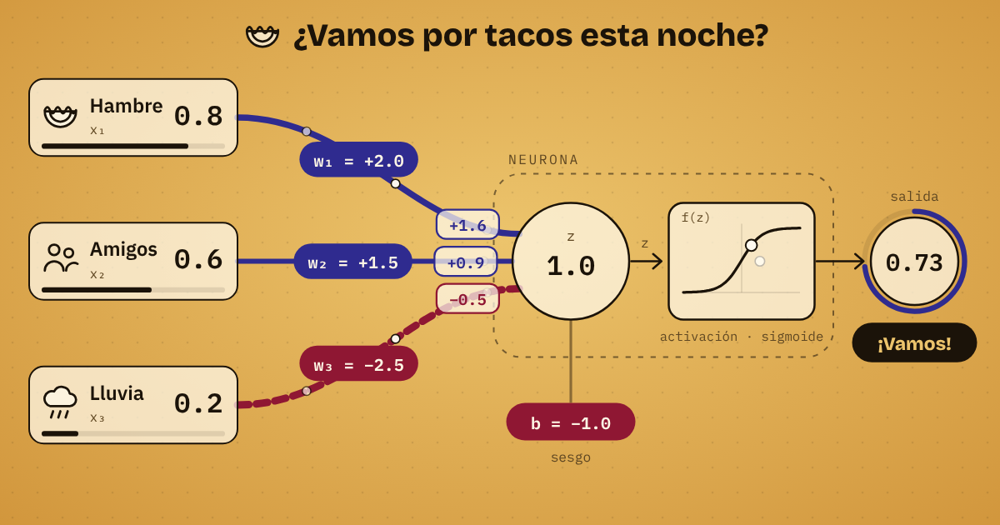
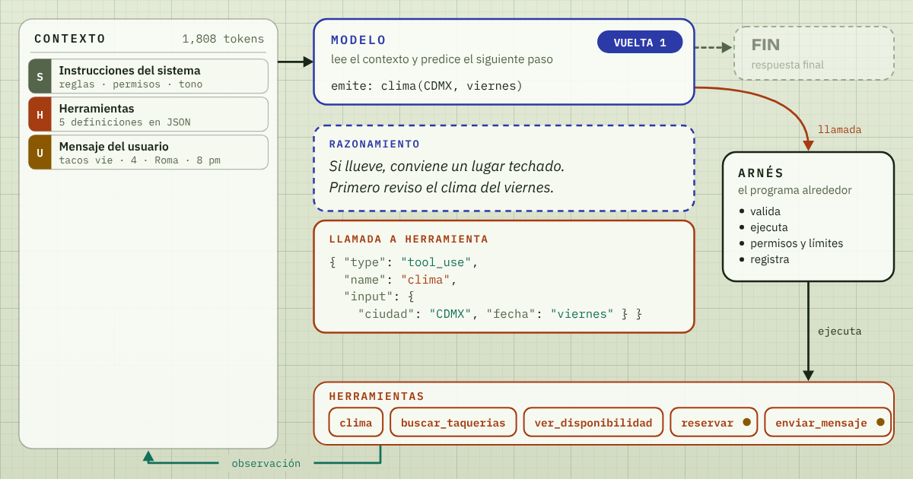

# Neurona Artificial · aprende IA por dentro

Curso abierto en español para entender la IA por dentro: cada lección es un video animado con capítulos y subtítulos, más un laboratorio para experimentar. El hilo conductor es una decisión cotidiana: **¿vamos por tacos esta noche?**

**Portada del curso:** https://jose2501106-ia.github.io/NeuronaArtificial/

## El diseño

El sitio usa el sistema de diseño **Neurona Artificial**, en su versión minimalista con la paleta **Barro y jade**: papel crudo de día, barro de noche y tinta café en lugar de negro. Se dibuja como un mapa de metro: el curso es una ruta, cada lección es una estación y cada parte de un sistema de IA es una línea con su color.

| Línea | Color | Estaciones |
|---|---|---|
| M · Modelos | rosa barro | 01 La neurona · 03 El Transformer · 04 Cómo aprende un gigante |
| D · Datos | ocre | 05 Los datos · 06 ¿Funciona? |
| S · Sistemas | jade | 02 El agente · 07 RAG y memoria · 08 Del laboratorio al mundo |
| P · Personas | añil | 09 IA responsable |

- **Tipografía:** Archivo Expanded para nombrar, Archivo para leer y Fragment Mono para datos y código, servidas desde el propio sitio (licencia SIL OFL).
- **Tema claro y oscuro:** sigue la configuración de tu dispositivo; el botón de la barra lo cambia y la elección se recuerda solo en tu navegador.
- **Dentro del video,** cada lección conserva su propio mundo (la tinción de Golgi de la neurona, la hoja de ingeniería del agente) y toma del sistema la tipografía y el color de su línea.
- **Accesible:** todo el texto pasa 4.5:1 de contraste en ambos temas, todo se usa con teclado y el color nunca va solo.

## La portada

- **La ruta:** nueve estaciones, de la neurona a la IA responsable, dibujadas como una línea de metro. Cada estación muestra si está terminada, abierta, en obra o planeada, y marca dónde vas.
- **El mapa del sistema:** las nueve capas de un sistema de IA real y en cuál vive cada lección.
- **Lecciones abiertas, método de estudio y recursos** para ir más lejos. Cada lección abierta despliega sus capítulos con enlace directo, para quien llega desde un video.
- **Tu progreso** se guarda solo en tu navegador: una lección se marca como terminada al llegar al final del video, o con el botón «Marcar como terminada».

## Lecciones

| # | Lección | Duración | Qué aprendes | Enlace |
|---|---------|----------|--------------|--------|
| 1 | **Cómo piensa una neurona artificial** | 4:06 | Entradas, pesos, suma, sesgo, activación, aprendizaje y el límite de una sola neurona. | [Abrir](https://jose2501106-ia.github.io/NeuronaArtificial/neurona/) |
| 2 | **Cómo actúa un agente de IA** | 6:21 | De predecir a actuar: modelo, herramientas, el ciclo pensar-actuar-observar, contexto y memoria, permisos e inyección de instrucciones. | [Abrir](https://jose2501106-ia.github.io/NeuronaArtificial/agentes/) |

### Lección 1 · La neurona

| # | Inicio | Capítulo |
|---|--------|----------|
| 1 | 0:00 | La inspiración |
| 2 | 0:23 | Las entradas |
| 3 | 0:45 | Los pesos |
| 4 | 1:14 | Suma y sesgo |
| 5 | 1:41 | La activación |
| 6 | 2:16 | La salida |
| 7 | 2:31 | Cómo aprende |
| 8 | 3:07 | El límite de una neurona |
| 9 | 3:36 | De una neurona a una red |

**Laboratorio:** mueve entradas, pesos y sesgo, cambia la función de activación, entrena la neurona y explora el mapa de decisión.

### Lección 2 · El agente

| # | Inicio | Capítulo |
|---|--------|----------|
| 1 | 0:00 | Del modelo al agente |
| 2 | 0:34 | El encargo |
| 3 | 1:06 | Las herramientas |
| 4 | 1:48 | El ciclo del agente |
| 5 | 2:34 | Cómo decide |
| 6 | 3:16 | Cuando algo falla |
| 7 | 3:52 | Contexto y memoria |
| 8 | 4:37 | Límites y permisos |
| 9 | 5:26 | Misión cumplida |

**Depurador:** maneja al agente paso a paso. Ves qué decide el modelo (con sus probabilidades), el JSON de cada llamada y resultado, la línea del ciclo en código que se está ejecutando y cómo crece el contexto. Tú apruebas o rechazas las reservas y los mensajes. Incluye tres escenarios (noche normal, todo lleno y una reseña con instrucciones escondidas), modo autónomo, límite de vueltas y compactación del contexto. Al final hay un glosario con los términos que usan los ingenieros.

## Cómo se usa

- Reproductor: pausa, línea de tiempo, velocidad, capítulos, pantalla completa y narración por voz opcional si tu navegador tiene una voz en español.
- Atajos de teclado: `Espacio` reproducir o pausar · `←` `→` 5 segundos · `C` subtítulos · `V` voz · `F` pantalla completa · `N` siguiente capítulo.
- Enlaces directos a un capítulo: agrega `#capitulo-3` a la dirección de la lección (por ejemplo, `neurona/#capitulo-3`). El video se abre en ese capítulo, con la opción de verlo desde el inicio. También sirven `#cap-3`, `#c3` y `#3`, y al elegir un capítulo de la lista la dirección cambia sola para que la copies.
- Tema claro y oscuro: sigue a tu dispositivo y se cambia con el botón de la barra.

## Archivos

| Archivo | Para qué sirve |
|---------|----------------|
| `index.html` | Portada del curso: la ruta, el mapa del sistema, las lecciones y el método. |
| `recursos/na.css` | El sistema de diseño: tipografías, colores claro y oscuro, estilos de texto y componentes. |
| `recursos/leccion.css` | El marco común de las lecciones: reproductor, capítulos, laboratorio. |
| `recursos/na.js`, `recursos/sitio.js` | Ayudantes del sistema (íconos, pictogramas) y el botón de tema. |
| `recursos/fuentes/` | Archivo Expanded, Archivo y Fragment Mono en woff2. |
| `preview.png` | Imagen de 1200 × 630 que aparece al compartir la portada. |
| `neurona/index.html` | Lección 1: su escenario, la animación y el laboratorio. |
| `neurona/preview.png` | Imagen para compartir la lección 1. |
| `agentes/index.html` | Lección 2: video, depurador y glosario. |
| `agentes/preview.png` | Imagen para compartir la lección 2. |
| `.nojekyll` | Le dice a GitHub Pages que publique los archivos tal cual. |

No hay nada que compilar: cada página es HTML con su propio script y comparte los estilos y las tipografías de `recursos/`. El sitio no carga nada de otros servidores.

## Cómo se publica

GitHub Pages sirve el sitio desde la rama `main`, carpeta raíz (Settings → Pages → Deploy from a branch → `main` / `/ (root)`). Cada commit en `main` se publica solo en uno o dos minutos.

## Notas

Los ejemplos son inventados para explicar la mecánica: los valores de la neurona, los lugares, las reseñas, los horarios, los tokens y las probabilidades no son reales. En la lección 2, un modelo real elige token por token; ahí se agrupan esas probabilidades por acción para que se vean. Los JSON siguen la forma de los bloques `tool_use` y `tool_result` de la API de Claude, simplificados.
